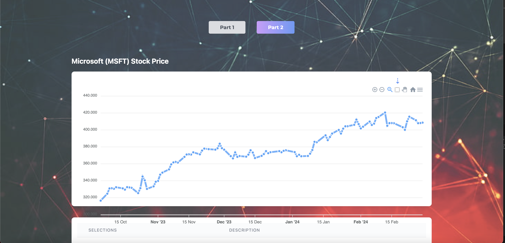

# Fentech App

# Functionalities

Mobile responsive App with two parts and unit testing.

- Part One:

- Add a text to a list
- Remove text on click

- Part Two:

- Click Marker and add description
- Click select icon in toolbar, select an interval of the graph and add description
- View the points and associated descriptions in the Grid below
- Others toolbar functionalities like zoom in, out and download of the chart

# How to run

- Start App :
- Install pakages `yarn install`  then run  `yarn dev`
- Run tests `yarn test`

## Screenshots

